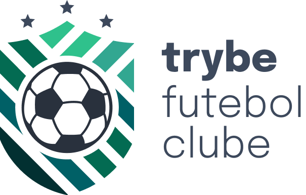

<h1 align="center">



</h1>

  <h3 align="center">TFC - Site informativo sobre partidas e classificações de futebol! ⚽️</h3>
  <br>

  <p align="center">
    <a href="https://www.betrybe.com/">
      
    </a>
    <a href="https://www.linkedin.com/in/andersonleitedev/">
      
    </a>
  </p>

---

<p align="center">
  <a href="#dart-sobre">Sobre</a> &#xa0; | &#xa0; 
  <a href="#rocket-tecnologias">Tecnologias</a> &#xa0; | &#xa0;
  <a href="#white_check_mark-configurações-necessárias">Configurações necessárias</a> &#xa0; &#xa0; | &#xa0;
   <a href="#checkered_flag-começando">Começando</a> &#xa0; | &#xa0;
  <a href="#framed_picture-imagens">Imagens</a> &#xa0; &#xa0;
</p>

<br>

## :dart: Sobre ##

No time de desenvolvimento do TFC, meu squad ficou responsável por desenvolver uma API (utilizando o método TDD) e também integrar - através do docker-compose - as aplicações para que elas funcionem consumindo um banco de dados.

Nesse projeto, precisei construir um back-end dockerizado utilizando modelagem de dados através do Sequelize. O desenvolvimento teve que respeitar regras de negócio providas no projeto e a API desenvolvida teve que ser capaz de ser consumida por um front-end já provido no projeto.

Para adicionar uma partida foi necessário ter um token, portanto a pessoa deverá estar logada para fazer as alterações. Houve um relacionamento entre as tabelas teams e matches para fazer as atualizações das partidas.

O meu back-end implementou regras de negócio para popular adequadamente a tabela disponível no front-end que será exibida para a pessoa usuária do sistema.

## :rocket: Tecnologias ##

#### As seguintes tecnologias foram utilizadas no projeto:

Frontend:
- [React](https://pt-br.reactjs.org/) | 17.0.2
- [React Router](https://reactrouter.com/en/main) | 6.0.2
- [Axios](https://axios-http.com/ptbr/docs/intro) | 0.24.0
- [uuid](https://www.npmjs.com/package/uuid) | 8.3.2

Backend:
- [Express](https://expressjs.com/pt-br/) | 4.17.1
- [mySQL2](https://www.npmjs.com/package/mysql2) | 2.3.3
- [Sequelize](https://sequelize.org/) | 6.9.0
- [bcrypt.js](https://www.npmjs.com/package/bcryptjs) | 2.4.3
- [jsonwebtoken](https://www.npmjs.com/package/jsonwebtoken) | 8.5.1
- [Cors](https://www.npmjs.com/package/cors) | 2.8.5
- [dotenv](https://www.npmjs.com/package/dotenv) | 10.0.0

Testes:
- [Mocha](https://mochajs.org/) | 9.2.1
- [Sinon](https://sinonjs.org/) | 13.0.1
- [Chai](https://www.chaijs.com/) | 4.3.6


## :white_check_mark: Configurações necessárias ##

<p>Necessário realizar as instalações:</p>

- Ter [Git](https://git-scm.com/) para clonar o projeto.
- Ter [Docker](https://www.docker.com/) para rodar o projeto

## :checkered_flag: Começando ##

#### Execute o comando git clone para realizar o clone do repositório

```bash
git clone https://github.com/andersonleite1/project-tfc.git
```

#### Entre na pasta do repositório clonado
```bash
cd project-tfc
```
#### Execute o projeto através do Docker

_Obs: você precisa ter o <a href="https://dev.to/andersonleite/instalacao-completa-do-docker-no-ubuntu-lts-5bpi">Docker</a> e <a href="https://dev.to/andersonleite/como-instalar-docker-compose-no-linux-2iin">Docker Compose</a> instalados e configurados na sua máquina para esse passo funcionar corretamente_

Para subir o container

```bash
npm run compose:up
```

Para derrubar o container

```bash
npm run compose:down
```
Para visualizar os logs

```bash
npm run logs
```

<p align="right">
  <a href="https://www.linkedin.com/in/andersonleitedev/">
    
  </a>
</p>
